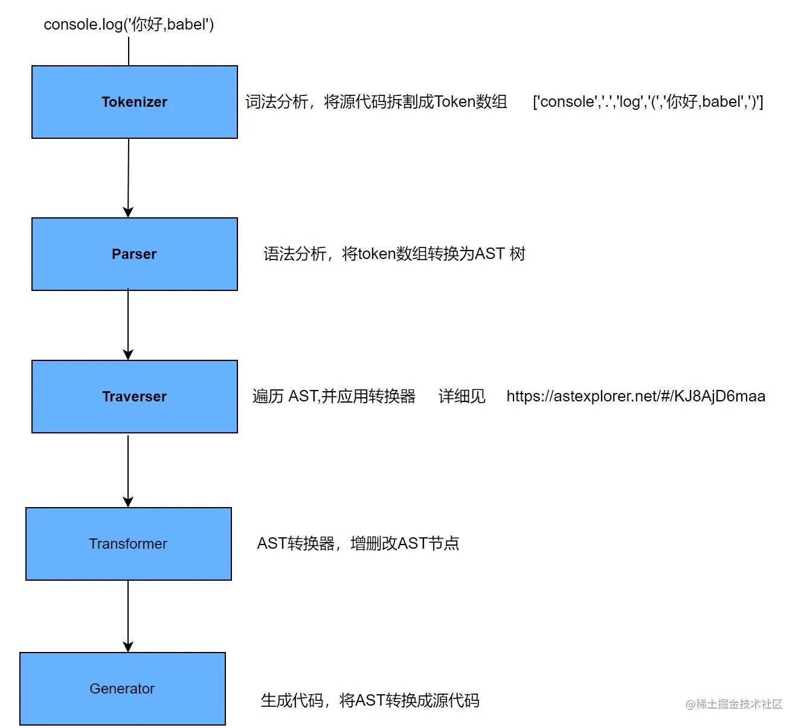

Babel 是什么？
Babel 是一个 JavaScript 编译器
Babel 是一个工具链，主要用于将采用 ECMAScript 2015+ 语法编写的代码转换为向后兼容的 JavaScript 语法，以便能够运行在当前和旧版本的浏览器或其他环境中。下面列出的是 Babel 能为你做的事情：

语法转换
通过 Polyfill 方式在目标环境中添加缺失的功能（通过引入第三方 polyfill 模块，例如 core-js）
源码转换（codemods）
更多参考资料！（请查看这些 视频 以获得启发）

```JavaScript
// Babel 接收到的输入是： ES2015 箭头函数
[1, 2, 3].map(n => n + 1);

// Babel 输出： ES5 语法实现的同等功能
[1, 2, 3].map(function(n) {
    return n + 1;
});
```

工作原理
babel 的主要工作流程分为三个阶段，解析(parse)，转换(transform)，生成(generate)

如下图所示:


解析
通过 @babel/parser 把源代码字符串转成抽象语法树(AST)，在解析过程中主要是两个阶段：词法分析和语法分析

词法分析：
词法分析阶段把字符串形式的代码解析成一个个具有实际意义的语法单元组成的数据，这种数据被称之为令牌（tokens）流。

什么是语法单元？
被解析语法当中具备实际意义的最小单元，举个例子：'2008 年奥运会在北京举行'，这句话不论词性主谓等关系，会把这句话拆分成： 2018 年、奥运会、在、北京、举行，这就是分词，把整句话拆分成有意义的最小颗粒，这些最小颗粒不能再继续拆分，否则会失去表达意义。

JavaScript 中常见的语法单元如下：

空白：JS 中连续的空格、换行、缩进等这些如果不在字符串里，就没有任何实际逻辑意义，所以把连续的空白符直接组合在一起作为一个语法单元。
注释：行注释或块注释，虽然对于人类来说有意义，但是对于计算机来说知道这是个“注释”就行了，并不关心内容，所以直接作为一个不可再拆的语法单元
字符串：对于机器而言，字符串的内容只是会参与计算或展示，里面再细分的内容也是没必要分析的
数字：JS 语言里就有 16、10、8 进制以及科学表达法等数字表达语法，数字也是个具备含义的最小单元
标识符：没有被引号扩起来的连续字符，可包含字母、\_、$、及数字（数字不能作为开头）。标识符可能代表一个变量，或者 true、false 这种内置常量、也可能是 if、return、function 这种关键字
运算符：+、-、\*、/、>、<等等
括号：(...)可能表示运算优先级、也可能表示函数调用，分词阶段并不关注是哪种语义，只把“(”或“)”当做一种基本语法单元
还有其他：如中括号、大括号、分号、冒号、点等等不再一一列举
语法分析：
语法解析器把 Tokens 转换为抽象语法树 AST

什么是 AST（Abstract Syntax Tree）?
抽象语法树 ，它是源代码语法结构的一种抽象表示。它以树状的形式表现编程语言的语法结构，树上的每个节点都表示源代码中的一种结构。

举例：

console.log('你好，babel')解析成 AST 后的 json 格式如下（转换可通过https://astexplorer.net/#/KJ8AjD6maa进行在线转换）:

类似于

{
"type": "Program",
"start": 0,
"end": 23,
"body": [...]
}
类似于这样的结构叫做节点，一个 AST 是由单个或者多个这样的节点构成的，节点内部还可以有子节点，构成一棵语法树。详细请见：https://juejin.cn/post/6844904035271573511

转换
通过@babel/traverse 遍历抽象语法树(AST),并调用 Babel 配置文件中的插件,对抽象语法树(AST)进行增删改

生成
通过@babel/generator 把转换后的抽象语法书(AST)生成目标代码

babel 插件
Babel 本身不具备转化功能，而是将转化功能分解到插件中，如果不配置任何插件，经过 babel 的代码和输入是相同的。

babel 的插件分类：
语法插件：
语法插件仅允许 babel 解析语法，不做转换操作；当添加语法插件后，使得 babel 能够解析更多的语法

例如：当我们定义或者调用方法时，最后一个参数之后是不允许增加逗号的，如 func(param1, param2,) 就是非法的。如果源码是这种写法，经过 babel 之后就会提示语法错误。

但最近的 JS 提案中已经允许了这种新的写法(让代码 diff 更加清晰)。为了避免 babel 报错，就需要增加语法插件 babel-plugin-syntax-trailing-function-commas

转译插件：
当添加转译插件后，会将源代码进行转译输出。

例如：箭头函数 (a) => a 就会转化为 function (a) {return a}。完成这个工作的插件叫做 babel-plugin-transform-es2015-arrow-functions。

什么是预设？
插件只对单个功能进行转换，当配置插件比较多时，就可以封装成预设（presets）以此来简化插件的使用，预设简单说就是一组原先设定好的插件，是一组插件的集合，比如 @babel/preset-react 包含以下插件：

@babel/plugin-syntax-jsx
@babel/plugin-transform-react-jsx
@babel/plugin-transform-react-display-name
比如 es2015 是一套规范，包含很多转译插件。如果每次要开发者一个个添加并安装，配置文件很长不说，npm install 的时间也会很长，为了解决这个问题，babel 还提供了一组插件的集合。因为常用，所以不必重复定义 & 安装。

常见的 preset 分为以下几种
官网常推荐的 详见：https://babel.docschina.org/docs/en/babel-preset-env/

@babel/preset-env 主要可以根据配置的目标浏览器或者运行环境来自动将 ES2015+的代码转换为 es5。

@babel/preset-react react 框架需要的

@babel/preset-flow flow 需要的。Flow 是一个静态类型检测工具，进行类型检查，类似于 ts

@babel/preset-typescript typescript 需要的

执行顺序
原则如下：

Plugin 会运行在 Preset 之前。
Plugin 会从前到后顺序执行。
Preset 的顺序则从后向前。
preset 的逆向顺序主要是为了保证向后兼容，因为大多数用户的编写顺序是 ['es2015', 'stage-0']。这样必须先执行 stage-0 才能确保 babel 不报错。因为低一级的 stage 会包含所有高级 stage 的内容

插件和 preset 的配置项
简单情况：插件和 preset 只需要列出字符串格式的名字即可

加参数情况：需要把自己先变成数组。第一个元素依然是字符串，表示自己的名字；第二个元素是一个对象，即配置对象。

举例：

"presets": [
// 带了配置项，自己变成数组
[
// 第一个元素依然是名字
"env",
// 第二个元素是对象，列出配置项
{
"module": false
}
],
// 不带配置项，直接列出名字
"stage-2"
]
重点配置项
以上我们已经了解和学习了 babel 相关的基础概念，但是对文章开头提到的 babel-\* 还未介绍，接下来详细介绍~

核心
@babel/core
是 babel 的核心，主要作用就是根据我们的配置文件转换代码，配置文件一般是.babelrc(静态文件)或 babel.config.js(可编程)，主要作用如下：

加载和处理配置(config)
加载插件
调用 Parser 进行语法解析，生成 AST
调用 Traverser 遍历 AST，并使用访问者模式应用'插件'对 AST 进行转换
生成代码，包括 SourceMap 转换和源代码生成
核心周边
Parser( @babel/parser ) ： 将源代码解析为 AST 。

Traverser( @babel/traverse ) ： 对 AST 进行遍历，转换插件会通过它获取感兴趣的 AST 节点，对节点继续操作

Generator( @babel/generator ) ： 将 AST 转换为源代码

集成
babel-cli
cli 是命令行工具。安装了 babel-cli 能够在命令行中使用 babel 来编译文件。

在开发 npm package 时经常使用如下模式：

把 babel-cli 安装为 devDependencies
在 package.json 中添加 scripts，使用 babel 命令编译文件
npm publish
这样既可以使用较新规范的 js 语法编写源码，同时可以支持旧版环境。如果你的项目不太大，用不到构建工具，在发布前可以使用 babel-cli 进行处理

babel-node
babel-node 是 babel-cli 的一部分，不需要单独安装，它的作用是在 node 环境中，直接运行 es2015 的代码，不需要额外代码转换

babel-register
babel-register 模块改写 require 命令，为它加上一个钩子。此后，每当使用 require 加载 js jsx es es6 后缀名的文件，会使用 babel 进行转码。

使用时，必须首先加载 require ('babel-register')，需要注意的是，babel-register 只会对 require 命令加载的文件转码，不会对当前文件转码，另外由于是实时转码，所以只适合在开发环境中使用

babel-polyfill
babel 默认值转换 js 语法，而不转换新的 API，比如 Generator、Maps 等全局对象，以及一些定义在全局对象上的方法（Object.assign）都不会转码。

例如：es5 在 Array 对象上新增了 Array.from 方法，babel 不会转码这个方法，如果要使用这个方法运行，必须使用 babel-polyfill

使用时，在所有代码运行之前增加 require('babel-polyfill')。或者更常规的操作是在 webpack.config.js 中将 babel-polyfill 作为第一个 entry。因此必须把 babel-polyfill 作为 dependencies 而不是 devDependencies

主要缺点：

使用 babel-polufill 导致打出来的包体积比较大，因为 babel-polyfill 是一个整体，把所有方法都会加到原型链上。比如使用了 Array.from，但它会把 Object.defineProperty 也给加上，属于一种浪费，要解决这个问题，可以通过单独使用 core-js 的某个类库解决，core-js 是分开的
babel-polyfill 会污染全局变量，给很多的原型链上作出修改，所以会比较倾向于使用 babel-plugin-transform-runtime
注意：如果代码中使用了较高版本的 js 实例方法， 比如 [1,2,3].includes(1),此时还是需要使用 polyfill

babel-runtime 和 babel-plugin-transform-runtime
有时语法的转换相对复杂，有时会需要一些 helper 函数，比如转换 es6 的 class

/_ test.js _/
const Test {}
/_ test-compiled.js _/
function \_classCallCheck(instance, Constructor) { if (!(instance instanceof Constructor)) { throw new TypeError("Cannot call a class as a function"); } }
var Test = function Test() {
\_classCallCheck(this, Test);
};
如图所示，es6 的 class 需要一个 \_classCallCheck 的辅助函数，如果有多个文件都用到了 es6 的 class，则需要在每个文件中都要定义一遍 ，会造成一种浪费；如果将 helper 函数都抽离到一个包中，所有用到的文件都可以引用可减少代码量。@babel/runtime ，提供了各种 helper 函数；那么问题又来了，我们该如何知道该引入哪个 helper 函数呢？ 所以又有了 @babel/plugin-transform-runtime 插件帮我们自动引入 helper

小结：

@babel/runtime: 提供各种 helper 函数

@babel/plugin-transform-runtime: 自动引入 helper 函数

预设
@babel/preset-env
可以根据配置的目标浏览器或者运行环境来自动将 ES5+的代码转换为 ES5

babel-loader
babel-loader 中的 loader 的主要作用是在 webpack 打包的时候，用 babel 将 ES6 的代码转换成 ES5 版本的

总结
名称 作用
个人实践
以上我们介绍了 babel 的基础概念和相关工作原理，理论不如实践，接下来让我们启动一个小项目来实践一下，印象会更深刻~

在开始之前简单介绍下常见的使用方式：

命令行 (cli)
构建工具的插件 (webpack 的 babel-loader, rollup 的 rollup-plugin-babel)
第二种多见于 package.json 中的 scripts 段落中的某条命令；第三种就直接集成到构建工具中。

@babel/core
主要作用：
主要负责代码的解析、转译、产生

demo 验证：
期望结果：希望箭头函数可以转换成 es5 写法

执行后：
结果：箭头函数经过转换没有变化，符合预期，因为在官网中有说到 @babel/core 是核心，但是具体转译为哪个版本的 js，需要用户自己定义，在 options 中添加参数处理

@babel/preset-env
主要作用：
可以根据配置的目标浏览器或者运行环境来自动将 ES5+的代码转换为 ES5

demo 验证：

执行后：

结果符合预期，成功 ES6 转换成 ES5

当做到这一步的时候，有一点比较好奇，既然说了是根据配置的目标浏览器或者运行环境来确定的，那上面的配置中没有设置目标浏览器, 是怎么确定的？是有默认配置么？默认配置是什么？

指定环境
上面的疑问均可在 @babel/preset-env 的 How Does it work https://babeljs.io/docs/en/babel-preset-env#how-does-it-work 中找到，babel 是通过 browserslist 来设置默认的环境版本的，其中在 browserlist 的 Queries 中提到了版本获取方法，第五条是默认版本，如下描述：

If the above methods did not produce a valid result Browserslist will use defaults: > 0.5%, last 2 versions, Firefox ESR, not dead（代表全球超过 0.5% 的人在使用的浏览器，支持各个浏览器的最近两个版本，火狐浏览器的最新版本，最新的两个版本中发现其市场份额已经大于 0.5% 并且 24 个月内有任务官方支持和更新了）

@babel-cli
主要作用：
上文有说到，@babel/cli 是允许使用命令行来编译文件，方便快捷

demo 验证：
新建 testBabelCli 文件

执行后：
npx babel testBabelCli.js --out-file ./src/testBabelCli-compiled.js --presets=@babel/preset-env

建议：以上为了演示 demo ，是使用的命令添加参数的方式进行转译，但是这样会比较麻烦，我们在项目开发时，可通过配置 babel.config.js 配置文件，执行时可自动读取该文件的配置

执行如下命令

npx babel testBabelCli.js --out-file ./src/testBabelCli-compiled.js
执行结果：

@babel/polyfill
主要作用：
对于比较新的 js 内置函数，可以进行转译

demo 验证（未使用 @babel/polyfill）：

执行后

以上代码中包含 const 关键词和 includes 数组方法,这些是 ES6 的新增的语法和 API, IE8 不支持，所以以上编译后，只转换了 const 关键词，对于新增的 API includes 没有转换

demo 验证（使用 @babel/polyfill）

执行后

全局引入了 core-js/modules/es7.array.includes.js 是对全局引入的，直接在对象的构造函数或者原型上添加方法，会出现污染全局变量，因此有 @babel/plugin-transform-runtime 插件出现解决此问题

@babel/plugin-transform-runtime
demo 验证：

执行后：

个人总结
经过以上学习总结实践，相信你对 babel 有一个基本的了解了，同时也证明 babel 是一个 js 的编译器的官网定义。 babel 本身并不具有转换功能，而是由更细粒度的插件转换，根本目的就是为了代码兼容在不同浏览器中，能够正常运行。后续还会对 babel 的编译原理等进行深入学习总结，以上仅是个人学习总结过程中的总结实践，有不足地方欢迎指出~
